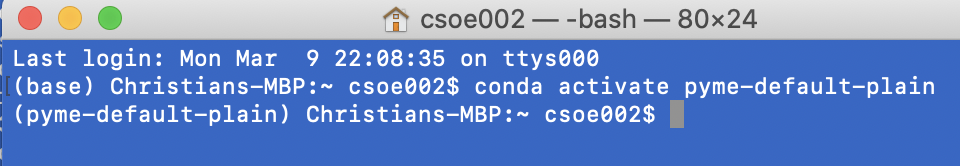

# Installing PYME on windows 10

## Installation customised for Soellerlab at the University of Exeter


This is a custom install that should ultimately work on most windows 10 machines. The install has the goal to make access to the latest code available relatively easily. It also reflects the relatively recent move of most code to github.

### Note for caution - this page is focused on py27

**NOTE**: This guide focuses on a python 2.7 based install. This is becoming more tricky as conda support for py27 is becoming more flaky due to py27 support phasing out. An updated guide will focus on a python 3 based install. PYME has a tentive date of Jan 2121 to phase out python 2.7 based support.

A separate Python 3.X based install will be developed on a separate page.

### Installation overview

The complete install can be broken down into a few higher level steps as follows:

1. Install the Anaconda python packaging system.

2. Install a github client to allow downloading the latest code from our code repositories.

3. Download the relevant code repositories using the github client.

4. Install a c/c++ compiler.

4. Build the main code packages using their respective setup procedures.

5. Make a few shortcut files etc to simplify launching the various apps (visgui, dh5view, etc).

6. Test the install.

#### 1. Install the Anaconda packaging system

STEP 1: Install Miniconda

Just follow the [STEP 1 paragraph](http://python-microscopy.org/doc/Installation/InstallationWithAnaconda.html#step-1-installing-miniconda) at David's site.

STEP 2: Open an anaconda prompt

Your start menu should contain an anaconda prompt command something like the one below:


This should open a command window, that has the ```(base)``` label at the beginning, indicating you are running in the base environment:


STEP 3: Create the PYME default environment

In the anaconda prompt window type the next 3 commands, one after another:

```python
conda config --append channels anaconda
conda config --add channels david_baddeley
conda create --name pyme-default-plain python=2.7 pyme-depends
```

STEP 4: Activate the PYME default environment

Now activate the new conda environment in your anaconda prompt window by typing:

    conda activate pyme-default-plain

This should change your command prompt to show that you are now within the pyme-default-plain environment, i.e.  ```(base)``` has changed to ```(pyme-default-plain)```:



STEP 5: Small fixes to correct conda issues

PART 5A: Attempt to install scikit-dev

Next, try installing the scikit-image package. Ok if this succeeds, not fatal if not. Again, type in the anaconda prompt window:

    conda install scikit-image

PART 5B: Fixing traitsui version

Recent conda appears to have an issue with traistui that installs v 7.X even though that requires python 3.X. Fix by forcing a v6 traitsui:

	conda install traitsui=6

#### 2. Install a github client

Our new repositories are kept on github (previously they were on bitbucket). We therefore need to replace the previously used tortoisehg with a suitable github client.

The currently preferred option is gitkraken.

##### Install gitkraken

My preferred git client at the moment is [gitkraken](https://gitkraken.com/git-client). Download the version for your computer and operating system. You need to make a gitkraken login (I seem to remember) and sign up for the free plan upon starting up the gitkraken app.

I forget if gitkraken also asks you for a github account, I should think it is not really needed if we only download repositories. So I think you should get away without registering a github account explicitly.

The next step is to clone a repository from github using gitkraken.

#### 3. Clone the relevant code repositories using the github client

##### Clone the python-microscopy repository

Using gitkraken, select the ```clone repository``` functionality, as shown below:


Now grab the URL for the python-microscopy repository. This is done by going to the github website for the python-microscopy repository. As shown below, make sure you have chosen HTTPS access and click the button to get the URL into the clipboard:


Then paste the URL into the URL box as shown below.

Also select a base directory where the repository will set. This could be a suitable directory on your hard disk, for example, somewhere in your documents folder. Note that we should select a common parent folder for our repositories, which will go individual subfolders in the is common parent directory. The screenshot below shows a subfolder on my macbook, so that may look a little different from your machine.

Finally, press the button to clone the repo. Cloning itself may take a little while until files are downloaded. Gitkraken should provide some kind of progress message.


##### Clone the PYME-extra repository

The steps are identical to the ones above to clone the python-microscopy repository, with the single difference being the URL you need to obtain. You obtain the URL from the PYME-extra github site ```https://github.com/csoeller/PYME-extra``` as shown below:


Once done paste the URL into the suitable box in gitkraken as was 
illustrated in detail above. Finally, press the button to clone the repo.


#### 4. Install a c/c++ compiler

##### For current builds use Microsoft Build Tools for Visual Studio 2019

For current builds of PYME a more recent compiler than the originally recommended *MS Visual C for Python 2.7* should be installed. Some details on compiler choice can be found on this page about [windows compiler choices for python](https://wiki.python.org/moin/WindowsCompilers). This suggests [Microsoft Build Tools for Visual Studio 2019](https://www.visualstudio.com/downloads/#build-tools-for-visual-studio-2019) as a more recent and functional choice. Apparently, recent anaconda/minconda will suggest this one during the installation and lead the user through the compiler installation process but I have not tried this yet.

I have tested installing this compiler manually on a win10 system that has an existing anconda install and also already had *MS Visual C for Python 2.7* on it.

I downloaded the installer from the [Microsoft Build Tools for Visual Studio 2019](https://www.visualstudio.com/downloads/#build-tools-for-visual-studio-2019) link and then ran it.

This brought up a window to select the components to install. I only ticked the C++ build tools option, as shown below. I then pressed the `Install` button which took a little while to complete (~6GB of stuff I think) and then asked me to reboot. Since then I have been able to successfully build a py3 based PYME from the latest github sources with this compiler. So should be good!


##### Older MS Visual C for Python 2.7 instructions

**Note**: For historic reference only, use the above recommended newer compiler for all current installs.

Building PYME requires a C compiler. On windows download and install [MS Visual C for Python 2.7](https://www.microsoft.com/en-us/download/details.aspx?id=44266).

**Note**: With the above suggested MS Visual C for Python 2.7 a problem will be encountered about a missing file `stdint.h`. This can be fixed by following the suggestion in the stackoverflow tip here: [https://stackoverflow.com/questions/44865576/python-scikit-image-install-failing-using-pip](). The proper solution is the newer compiler as described above.

#### 5. Build the main code packages using their respective setup procedures.

##### Build python-microscopy

1. Make sure you are using the anaconda prompt as you had used above.

2. Next make sure you have activated the pyme-default-plain environment. Remember that you only need to use the ```conda activate``` command if you do not yet see the ```(pyme-default-plain)``` at the command prompt, but rather ```(base)```  or something similar. If necessary, issue the command:

        conda activate pyme-default-plain

This should change your command prompt to show that you are within the pyme-default-plain environment, i.e.  ```(base)``` has changed to ```(pyme-default-plain)```.

3. Now cd into the base directory of the python-microscopy repository on your disk. That directory should contain a file ```setup.py``` as well as the subdirectory ```PYME``` and a bunch of other things.

4. Once in the right directory, issue the command to build python-microscopy in development mode:

        python setup.py develop

This will build PYME and will take a little while to compile all the code etc. During this time a lot of message will be printed to the screen. Some of these will be compiler warnings which can be safely ignored.

You should now be able to test the installation for the ability to call dh5view and visgui from the command line, e.g., type, at the same command prompt you used for building PYME:

        dh5view -t -m lite

This should bring up dh5view with a small image containing random noise, as shown here


##### Build PYME-extra

1. Make sure you are using the anaconda prompt as you had used above.

2. Next make sure you have activated the pyme-default-plain environment. Remember that you only need to use the ```conda activate``` command if you do not yet see the ```(pyme-default-plain)``` at the command prompt, but rather ```(base)```  or something similar. If necessary, issue the command:

        conda activate pyme-default-plain

  This should change your command prompt to show that you are within the pyme-default-plain environment, i.e.  ```(base)``` has changed to ```(pyme-default-plain)```.

3. Now cd into the base directory of the ```pyme-extra``` repository on your disk. That directory should contain a file ```install_plugins.py``` as well as the subdirectory ```PYMEcs``` and a bunch of other things.

4. We need one extra step to make sure that the FRC functionality works properly. This is achieved by installing the ```statsmodels``` package:

        conda install statsmodels

5. Assuming the previous step worked fine, now it is time to build the PYME-extra code:

        # make sure you are in a terminal where the enviroment is activated!!!!
        #
        # normally you activate the environment first with
        # omit this step if you are already in the environment in the command shell
        conda activate pyme-default-plain
        # cd to the PYME-extra subdirectory before issuing the commands below!
        
        python setup.py develop
        python install_plugins.py

  Note that we leave out the ```dist``` argument in the plugin install call since we are installing to your local login. We could probably also install to dist, but I want to try it like this first.

6. Test: At this stage you should bring up visgui again, say, and check that all the expected extra menus are available.


#### 6. Make a few shortcut files and launchers

The details for this part of the install have gone into their own document which you can find in the same folder.

#### 7. Testing the install

Tests have been described above in various parts of the install. Please check out the various steps for details.
