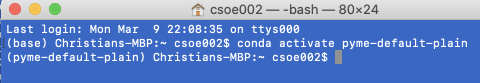
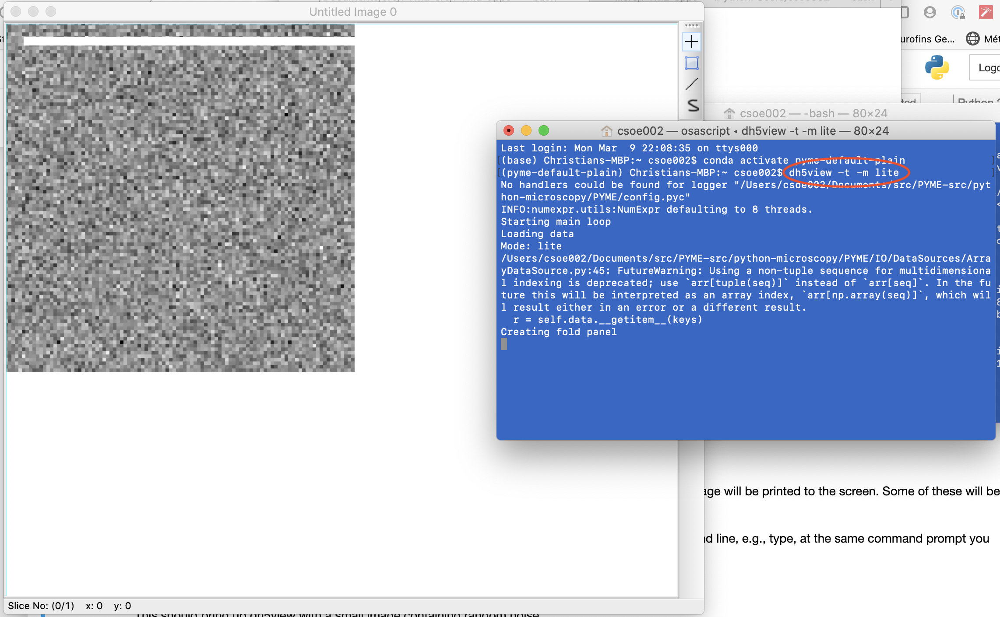

# Installing PYME on macOS - Python 3.X based install

## Installation customised for Soellerlab at the University of Exeter

This is a custom install that should ultimately work on most macOS machines. The install has the goal to make access to the latest code available relatively easily. It also reflects the relatively recent move of most code to github.

### Note for caution - this page is focused on py3

**NOTE**: This guide focuses on a python 3.X based install. PYME has a tentive date of Jan 2121 to phase out python 2.7 based support.

### Installation overview

The complete install can be broken down into a few higher level steps as follows:

1. Install the Anaconda python packaging system.

2. Install a github client to allow downloading the latest code from our code repositories.

3. Download the relevant code repositories using the github client.

4. Install a c/c++ compiler.

4. Build the main code packages using their respective setup procedures.

5. Make a few shortcut files etc to simplify launching the various apps (visgui, dh5view, etc).

6. Test the install.

#### 1. Install the Anaconda packaging system

STEP 1: Install Miniconda

Just follow the [STEP 1 paragraph](http://python-microscopy.org/doc/Installation/InstallationWithAnaconda.html#step-1-installing-miniconda) at David's site.

STEP 2: Open a terminal on macOS

Just start the terminal app.

STEP 3: Create the PYME default environment

In the anaconda prompt window type the next 3 commands, one after another:

```python
conda config --append channels anaconda
conda config --add channels david_baddeley
conda create --name pyme-py3 python=3.6 pyme-depends
```
**Note**: Need to check if 3.6 is still the recommended version.

STEP 4: Activate the PYME default environment

Now activate the new conda environment in your anaconda prompt window by typing:

    conda activate pyme-py3

This should change your command prompt to show that you are now within the pyme-py3 environment, i.e.  ```(base)``` has changed to ```(pyme-py3)```.



STEP 5: Small fixes to correct conda issues

PART 5A: Attempt to install scikit-dev

Next, try installing the scikit-image package. Ok if this succeeds, not fatal if not. Again, type in the anaconda prompt window:

    conda install scikit-image

PART 5B: Upgrade pyface to >=7.1.0

With the new traitsui 7.X in place we get an error about a conflict about the by default installed pyface - *pkg_resources.VersionConflict: (pyface 6.1.2 (/Users/csoe002/opt/anaconda2/envs/pyme-py3/lib/python3.7/site-packages), Requirement.parse('pyface>=7.1.0'))*

Fix with:

	conda install pyface=7

Further parts will be added as needed.

#### 2. [Optional] Install a github client

Our new repositories are kept on github (previously they were on bitbucket). We therefore need to replace the previously used tortoisehg with a suitable github GUI client if so desired. Note that a command line git should be available out of the box.

See the win10 focused install instructions for details on installing and using gitkraken.

#### 3. Clone the relevant code repositories using the github client

##### Clone the python-microscopy repository

Using gitkraken, select the ```clone repository``` functionality, as shown in the win10 based installation guide.

#### 4. Install a c/c++ compiler

This step is not required on macOS generally although first time around you may need to make sure the XCode command line tools are installed.

**Check**: there may be command line tool instructions with anaconda/miniconda!
	
#### 5. Build the main code packages using their respective setup procedures.

##### Build python-microscopy

1. Make sure you are at the terminal prompt as you had used above.

2. Next make sure you have activated the pyme-py3 environment. Remember that you only need to use the ```conda activate``` command if you do not yet see the ```(pyme-py3)``` at the command prompt, but rather ```(base)```  or something similar. If necessary, issue the command:

        conda activate pyme-py3

This should change your command prompt to show that you are within the pyme-py3 environment, i.e.  ```(base)``` has changed to ```(pyme-py3)```.

3. Now cd into the base directory of the python-microscopy repository on your disk. That directory should contain a file ```setup.py``` as well as the subdirectory ```PYME``` and a bunch of other things.

4. Once in the right directory, issue the command to build python-microscopy in development mode. Note that we use the explicit path to the macOS python binary as we otherwise have issues with GUI apps, and get messages of the type *This program needs access to the screen. Please run with a Framework build of python, and only when you are logged in on the main display of your Mac.* The command below avoids that happening (replace with your path to the python binary **in the pyme-py3 environment**).

        /Users/XXX/opt/anaconda2/envs/pyme-py3/python.app/Contents/MacOS/python setup.py develop

This will build PYME and will take a little while to compile all the code etc. During this time a lot of message will be printed to the screen. Some of these will be compiler warnings which can be safely ignored.

You should now be able to test the installation for the ability to call dh5view and visgui from the command line, e.g., type, at the same command prompt you used for building PYME:

        dh5view -t -m lite

This should bring up dh5view with a small image containing random noise, as shown here




