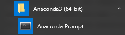
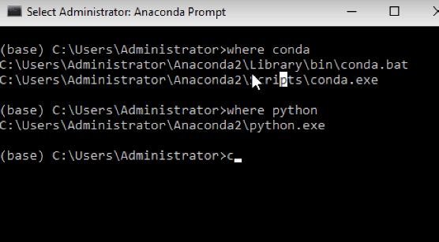
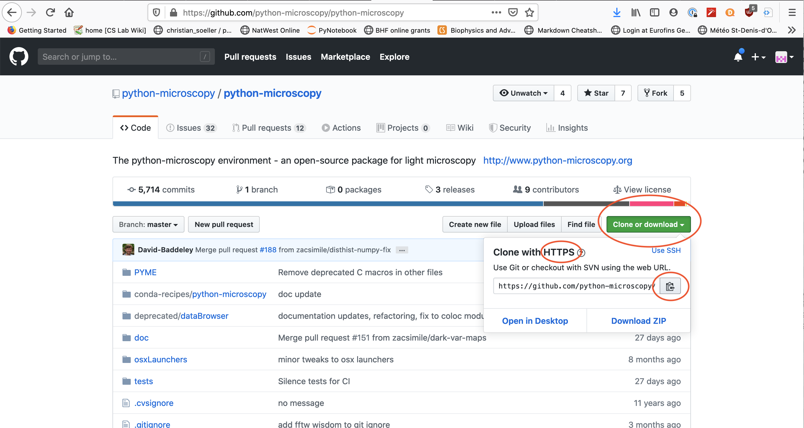
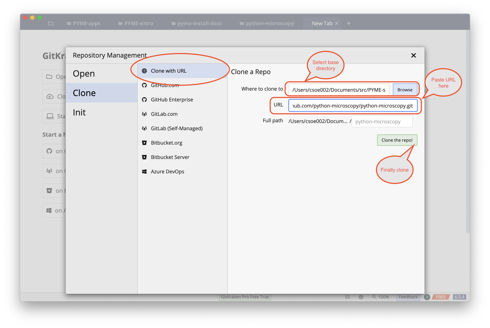
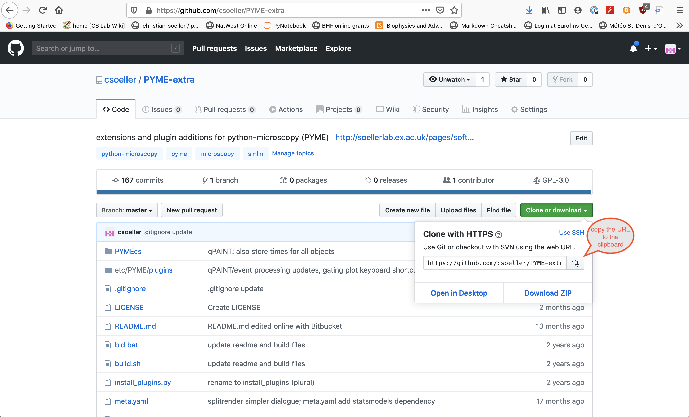
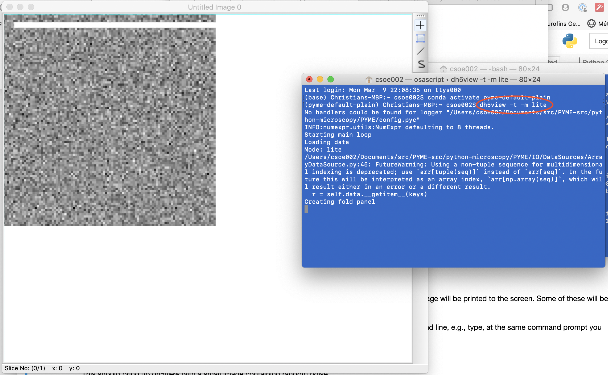

# Installing PYME on windows 10

## Installation customised for Soellerlab at the University of Exeter


This is a custom install that should ultimately work on most windows 10 machines. The install has the goal to make access to the latest code available relatively easily. It also reflects the relatively recent move of most code to github.

### This page is focused on py3

**NOTE**: This guide focuses on a python 3.7 based install. Python 2.x based installs are discouraged as we are now beyond the supported lifetime of python 2.X.

### Installation overview

The complete install can be broken down into a few higher level steps as follows:

1. Install the Anaconda python packaging system.

2. Install a github client to allow downloading the latest code from our code repositories.

3. Download the relevant code repositories using the github client.

4. Install a c/c++ compiler.

4. Build the main code packages using their respective setup procedures.

5. Make a few shortcut files etc to simplify launching the various apps (visgui, dh5view, etc).

6. Test the install.

#### 1. Install the Anaconda packaging system

#####  Step 1: Install Miniconda

Just follow the [STEP 1 paragraph](http://python-microscopy.org/doc/Installation/InstallationWithAnaconda.html#step-1-installing-miniconda) at David's site.

**Note**: When installing miniconda you generally have a choice between different installers for python 2 and python 3. From the [miniconda docs](https://docs.conda.io/en/latest/miniconda.html): 

*There are two variants of the installer: Miniconda is Python 2 based and Miniconda3 is Python 3 based. Note that the choice of which Miniconda is installed only affects the root environment. Regardless of which version of Miniconda you install, you can still install both Python 2.x and Python 3.x environments.*

Bottom line: it really doesn't matter as we will build a separate environment for PYME. But if you are pondering we advise a miniconda3 install as Python 3.X is the now fully supported version and you may want to use your `base` environment to play with Python commands using a 3.x version to practice Python 3 syntax and conventions.

#####  Step 2: Open an anaconda prompt

Your start menu should contain an anaconda prompt command something like the one below:



This should open a command window, that has the ```(base)``` label at the beginning, indicating you are running in the base environment:



#####  Step 3: Create the PYME default environment

In the anaconda prompt window type the next 2 commands, one after another:

```python
conda config --add channels david_baddeley
conda create --name pyme-py37 python=3.7 pyme-depends
```

#####  Step 4: Activate the PYME default environment

Now activate the new conda environment in your anaconda prompt window by typing:

    conda activate pyme-py37

This should change your command prompt to show that you are now within the pyme-py3 environment, i.e.  ```(base)``` has changed to ```(pyme-py37)``` (in the screenshot below we demonstrate this with an environment called `pyme-default-plain`):


#####  Step 5: Small fixes to correct conda issues

Currently there seem to be no fixes required (as of March 2021).

#### 2. Install a github client

Our new repositories are kept on github (previously they were on bitbucket). We therefore need a suitable github client.

The currently preferred option is an app called `gitkraken`.

##### Install gitkraken

My preferred git client at the moment is [gitkraken](https://gitkraken.com/git-client). Download the version for your computer and operating system. You need to make a gitkraken login (I seem to remember) and sign up for the free plan upon starting up the gitkraken app.

I forget if gitkraken also asks you for a github account, I should think it is not really needed if we only download repositories. So I think you should get away without registering a github account explicitly.

The next step is to clone a repository from github using gitkraken.

#### 3. Clone the relevant code repositories using the github client

##### Clone the python-microscopy repository

Using gitkraken, select the ```clone repository``` functionality, as shown below:


Now grab the URL for the python-microscopy repository. This is done by going to the github website for the [python-microscopy repository](https://github.com/python-microscopy/python-microscopy). As shown below, make sure you have chosen HTTPS access and click the button to get the URL into the clipboard:




Then paste the URL into the `gitkraken` URL box as shown below.

Also select a base directory where the repository will reside on your disk. This should be a suitable directory on your hard disk, for example, somewhere in your documents folder. Note that we should select a common parent folder for our repositories, which will go into individual subfolders in the is common parent directory. The screenshot below shows a subfolder on my macbook, so that may look a little different from your machine.

Finally, press the button to clone the repo. Cloning itself may take a little while until files are downloaded. Gitkraken should provide some kind of progress message.




##### Clone the PYME-extra repository

The steps are identical to the ones above to clone the python-microscopy repository, with the single difference being the URL you need to obtain. You obtain the URL from the PYME-extra github site [https://github.com/csoeller/PYME-extra](https://github.com/csoeller/PYME-extra) as shown below:



Once done paste the URL into the suitable box in gitkraken as was 
illustrated in detail above. Finally, press the button to clone the repo.


#### 4. Install a c/c++ compiler

For current builds of PYME a suitable compiler must be installed.

Details on the process you find on the [Windows compiler page](Installing a compiler on windows.md).

#### 5. Build the main code packages using their respective setup procedures.

##### Build python-microscopy

1. Make sure you are using the anaconda prompt as you had used above.

2. Next make sure you have activated the pyme-py37 environment. Remember that you only need to use the ```conda activate``` command if you do not yet see the ```(pyme-py37)``` at the command prompt, but rather ```(base)```  or something similar. If necessary, issue the command:

        conda activate pyme-py37

This should change your command prompt to show that you are within the pyme-py37 environment, i.e.  ```(base)``` has changed to ```(pyme-py37)```.

3. Now cd into the base directory of the python-microscopy repository on your disk. *This directory will be different for each machine* and is where you previously cloned the python-microscopy repository. That directory should contain a file ```setup.py``` as well as the subdirectory ```PYME``` and a bunch of other things.

4. Once in the right directory, issue the command to build python-microscopy in development mode:

        python setup.py develop

This will build PYME and will take a little while to compile all the code etc. During this time a lot of messages will be printed to the screen. Some of these will be compiler warnings which can be safely ignored.

**If you encounter errors**: best practice is to select **all text** in the command window using `<Ctrl-A>`, copy with `<Ctrl-C>` and paste using `<Ctrl-V>` into an empty `notepad` editor window, then save as something like `myinstall-log.txt` or similar. Then upload the file somewhere where we can all inspect it.

Everything going well, you should now be able to test the installation for the ability to call dh5view and visgui from the command line, e.g., type, at the same command prompt you used for building PYME:

        dh5view -t -m lite

This should bring up dh5view with a small image containing random noise, as shown here





##### Build PYME-extra

1. Make sure you are using the anaconda prompt as you had used above.

2. Next make sure you have activated the pyme-py3 environment. Remember that you only need to use the ```conda activate``` command if you do not yet see the ```(pyme-py37)``` at the command prompt, but rather ```(base)```  or something similar. If necessary, issue the command:

        conda activate pyme-py37

This should change your command prompt to show that you are within the pyme-py37 environment, i.e.  ```(base)``` has changed to ```(pyme-py37)```.

3. Now cd into the base directory of the ```pyme-extra``` repository on your disk. That directory should contain a file ```install_plugins.py``` as well as the subdirectory ```PYMEcs``` and a bunch of other things.

4. We need one extra step to make sure that the FRC functionality works properly. This is achieved by installing the ```statsmodels``` package:

        conda install statsmodels

5. Assuming the previous step worked fine, now it is time to build the PYME-extra code:

        # make sure you are in a terminal where the enviroment is activated!!!!
        #
        # normally you activate the environment first with
        # omit this next step if you are already in the environment in the command shell
        conda activate pyme-py37
        # cd to the PYME-extra subdirectory before issuing the commands below!
        
        python setup.py develop
        python install_plugins.py

Note that we leave out the ```dist``` argument in the plugin install call since we are installing to your local login. We could probably also install to dist, but I want to try it like this first.

6. Test: At this stage you should bring up visgui again, say, and check that all the expected extra menus are available. [*Note to self, show what menus should be available*]


#### 6. Make a few shortcut files and launchers

The details for this part of the install have gone into their own document which you can find in this repository.

#### 7. Testing the install

Tests have been described above in various parts of the install. Please check out the various steps for details.
