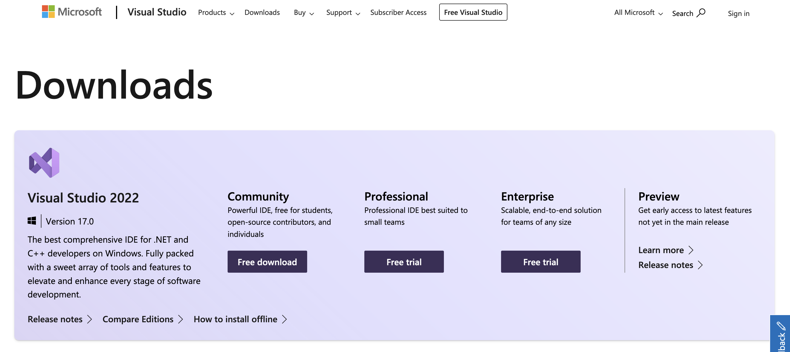
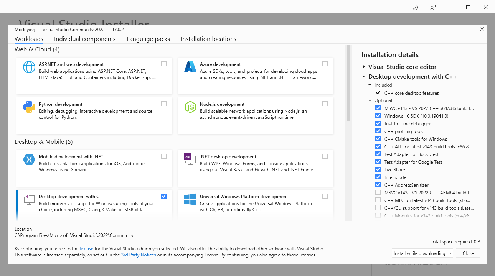

# Installing a suitable c/c++ compiler on windows

To build the PYME code from source one needs a suitable C/C++ compiler. On windows 10, until recently the [Microsoft Build Tools for Visual Studio 2019](https://www.visualstudio.com/downloads/#build-tools-for-visual-studio-2019), see below, were the default compiler of choice.

Since about December 2021, the link above instead leads to the general [Visual Studio Downloads page](https://visualstudio.microsoft.com/downloads/). At the time of writing, this looks as below:

## Currently recommended install

As of December 2021 the `Visual Studio 2022 Community Install` is now the recommended compiler installation which we detail below. For reference, we also include the previously recommended `Microsoft Build Tools for Visual Studio 2019` installation notes at the end.

### Visual Studio 2022 Community Install

With the **Microsoft Build Tools for Visual Studio 2019** not available any more I tried the `Community - Free Download` from the [Visual Studio Downloads page](https://visualstudio.microsoft.com/downloads/).

Selecting the `Free Download` button loads an executable installer. Running that exectuable installer pulls in the actual Visual Studio Installer which offers selecting components to be installed. In the section `Desktop & Mobile` one can select `Desktop development with C++`, as shown below:

Once you select just this box and then start the actual install you are told the size of the installed components (I think it was ~9GB) and the download and install starts.

Wait for that to complete, then you end up with this window:

You can stop the installer here and are done.

If you click the `Modify` button you see this, which shows the installed components as below (in theory you could now select more components to be installed). We show it here only to illustrate the components that were installed.

At this stage you have a working compiler install and can start the build process.

### SUPERSEDED -  Microsoft Build Tools for Visual Studio 2019

**Note**: this was the previously endorsed compiler install that is not available for download anymore (as of December 2021).

For current builds of PYME a suitable compiler must be installed. Some details on compiler choices can be found on this page about [windows compiler choices for python](https://wiki.python.org/moin/WindowsCompilers). This suggests [Microsoft Build Tools for Visual Studio 2019](https://www.visualstudio.com/downloads/#build-tools-for-visual-studio-2019) as a recent and functional choice which we describe in further detail below. Apparently, recent anaconda/minconda installs will suggest this one during the installation and lead the user through the compiler installation process (but I have not tried this yet).

I have so far tested installing this compiler manually on a win10 system that has an existing anconda install and also already had *MS Visual C for Python 2.7* on it.

I downloaded the installer from the [Microsoft Build Tools for Visual Studio 2019](https://www.visualstudio.com/downloads/#build-tools-for-visual-studio-2019) link and then ran it.

This brought up a window to select the components to install. I only ticked the C++ build tools option, as shown below. I then pressed the `Install` button which took a little while to complete (6GB of stuff I think) and then asked me to reboot. Since then I have been able to successfully build a py3 based PYME from the latest github sources with this compiler. So should be good!

