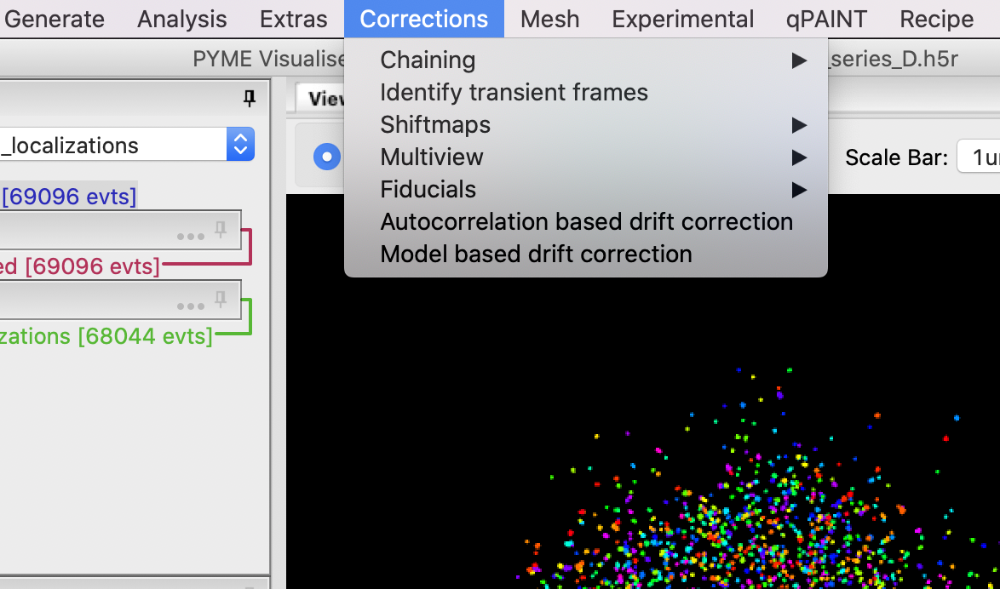

# Install PYMEnf (PYME-nonfree)

## New instructions: Install ``PYMEnf``from private repo

### Install ``Github-desktop``as a free GUI client

This only needs to be done if you have not installed this client already.

You find the client at the [github site](https://desktop.github.com/). Follow the download and install instructions.

Start ``github-desktop``. The first time around you will have to supply your github credentials and authorize this app at github.

### Clone ``pymenf``repository

The next step is to clone the ``csoeller/pymenf`` repo to your local machine which you do by selecting ``File>Clone...`` and ask the client to clone the repo as shown below, by supplying its name in the URL tab:


Select a suitable directory where to copy the files to, you can select the default or use a directory of your choosing.

This should clone the repo and you can click on the repo name in the left tab to get the view shown below:


You are done at this stage. In the future you can press the ``Fetch origin`` button to pull down new code changes to your local repo clone.

### Build the pymenf code

You want to now cd into the newly created pymenf directory (that contains the copy clonded via ``github-desktop``) and build the pymenf package as shown below.

```shell
        # make sure you are in a terminal where the correct enviroment is activated!!!!
        #
        # normally you activate the environment first using the conda command below
        # omit this step if you are already in the environment in the command shell
        # double check the name of the environment to be the name that you use on your machine
        conda activate pyme-shared
        # cd to the PYMEnf subdirectory before issuing the commands below!
        
        python setup.py develop
        python install_plugins.py
```

Note that we leave out the ```dist``` argument in the plugin install call since we are installing to your local login. We could probably also install to dist, but I want to try it like this first.

### Check that we can use pymenf functionality in visgui

If the build and plugin install worked ok, we should now have a new functionality for drift correction within VisGUI. In the ```Corrections``` menu there should be a new choice ```Model based drift correction``` as shown below. Check if this is present and if not it is time to start the trouble shooting:




## Obsolete Instructions: Install from zip archive

### Unzip the pymenf code

I have resorted to distributing the PYMEnf code via a zip archive (long story why this is not publicly shared via github at the moment). A zip file of  ```PYMEnf``` named with `pymenf` and a date in the name can be found in the `PYMEnf` subdirectory of our shared OneDrive folder with microscopy related stuff.

Get the archive from there and unpack into the same directory that has already the ```python-microscopy``` and ```PYME-extra``` repos in it. Unpacking it should create a new folder ```pymenf-master``` (the `master` bit refers to this stemming from the `master` branch of the repo).


### Build the pymenf code

You want to now cd into the newly created pymenf directory and build the pymenf package as shown below.

        # make sure you are in a terminal where the enviroment is activated!!!!
        #
        # normally you activate the environment first using the conda command below
        # omit this step if you are already in the environment in the command shell
        conda activate pyme-default-plain
        # cd to the PYMEnf subdirectory before issuing the commands below!
        
        python setup.py develop
        python install_plugins.py

Note that we leave out the ```dist``` argument in the plugin install call since we are installing to your local login. We could probably also install to dist, but I want to try it like this first.

### Check that we can use pymenf functionality in visgui

If the build and plugin install worked ok, we should now have a new functionality for drift correction within VisGUI. In the ```Corrections``` menu there should be a new choice ```Model based drift correction``` as shown below. Check if this is present and if not it is time to start the trouble shooting:


```python

```
