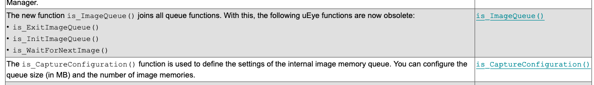
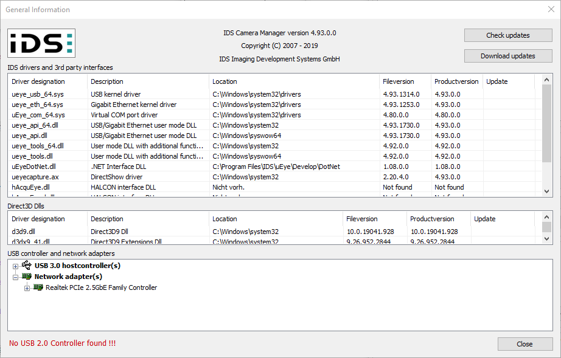
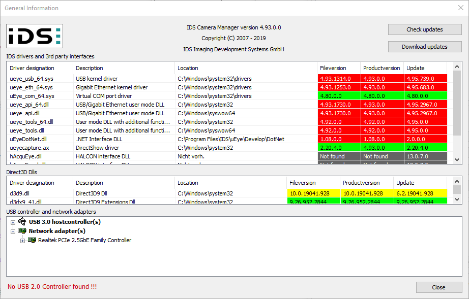

# IDS camera setup

## Install relevant software

Get software from [https://de.ids-imaging.com/downloads.html](https://de.ids-imaging.com/downloads.html). Find your model and download the relevant support software for windows, 64 bit. This needs an IDS login account (which I made several years go). Note that their software is provided free of charge.

### Installation and version selection

There is generally an installer provided in a zip file. Execute that installer, I went with the default selections which seemed fine.

For me the version I tested first was the current release 4.95 which unpacked in a directory `ids-software-suite-win-4.95`.

I started out with that version and all the initial tests were fine using the apps that come with the IDS software (see `Initial testing` below). However, after running the `PYMEAcquire` app with the relevant ueye init files, I noticed that acquisition would stop semi-randomly after changing integration time, changing ROIs or taking a snapshot (`F5`). This happened reproducibly with both backends (more about the two available backends see below).

I then looked at `What's new` for the 4.95 version and came across the following:

This suggested that the queue handling functions used in our backends at the moment are obsolete. With this hunch I downgraded the software version to 4.93. The IDS download section generally has old versions of the software available at the bottom of the list of available downloads (~16 packages when I had a look).

I first needed to uninstall version 4.95 otherwise I could not execute the 4.93 installer. There was an `uninst.exe` in the IDS directory which I think I executed. But there should also be the ability to use Windows 10 `Apps & features` and select the IDS ueye package for uninstallation.

With 4.93 in place everything worked as normal again. I can't be sure the version downgrade is the root cause but possibly some other aspect related to the uninstall/reinstall could have been an alternative explanation. This should be revisited and possibly we should consider updating to the new queue handling interface functions to see if that makes everything behave smoothly again with version 4.95.

Here is what I ended up with in terms of software versions installed for 4.93, displayed using the application `IDS Camera Manager` that comes with the software.

If one checks for updates, as expected the 4.95 version is shown as available update, see below, but I left everything at 4.93.

### Initial testing

Run the application `uEye cockpit` which should allow detecting and starting connected cameras.

### Find relevant DLLs

The backends need to find the relevant dlls. This is generally ensured by adding the directory containing the relevant dlls to the `PATH` environment variable.

This is easily established via the launchers and generally my preferred approach. The launcher for `PYMEAcquire` instances that use the ueye cameras contain a statement like this:

     set PATH=c:\ProgramData\Miniconda3\condabin;C:\Program Files\IDS\uEye\develop\bin;%PATH%

### Direct DLL calling backend vs pyueye backend

Current PYME has two alternative backends, one directly using the IDS DLLs, the other goes through the pretty lightweight `pyueye` interface.

#### uc480 interface

The original backend is available via the module `PYME.Acquire.Hardware.uc480.uCam480.py`. This is possibly more tested but not without its problems. There is some cruft and every new feature needs to consult the IDS created structures in some detail with use of `ctypes` methods to perform the necessary translations.

#### pyueye interface

A more recent alternative interface uses the `pyueye` module from IDS, a fairly lightweight Python wrapper around the DLLs. It is most easily installed with `pip`:

	pip install pyueye

This interface is not quite as feature complete yet but I have been adding a few features so that it should not take too long to match the existing uc480 one. The primary advantage that I can see is that all the myriad of constants and structures are available in conveniently wrapped form via `pyueye` whereas with the direct uc480 code one needs to do all the legwork when new features are added. In addition, IDS appears to update it semi-regularly.

#### Config files

We have example config files for both the uc480 and the pyueye interface in the [PYME-exeter-siteconfig](https://github.com/csoeller/PYME-exeter-siteconfig) repo, in the `generic` subfolder of the init scripts folder.

### Setup relevant launcher

**TODO**... link to launcher in siteconfig repo

## Tests

**TODO**: relevant tests...

