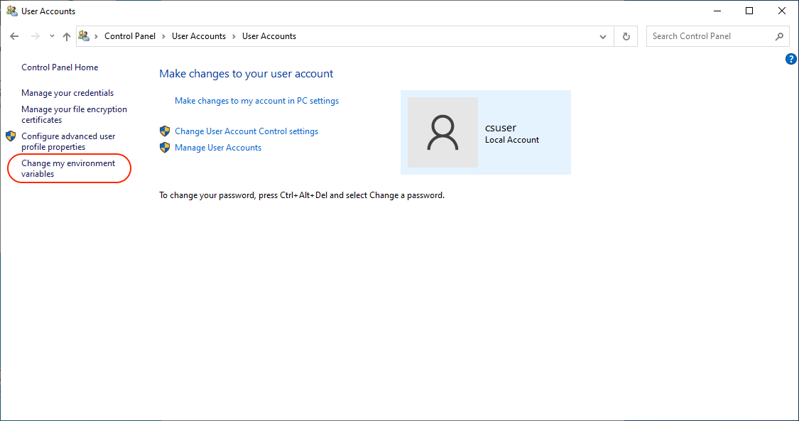
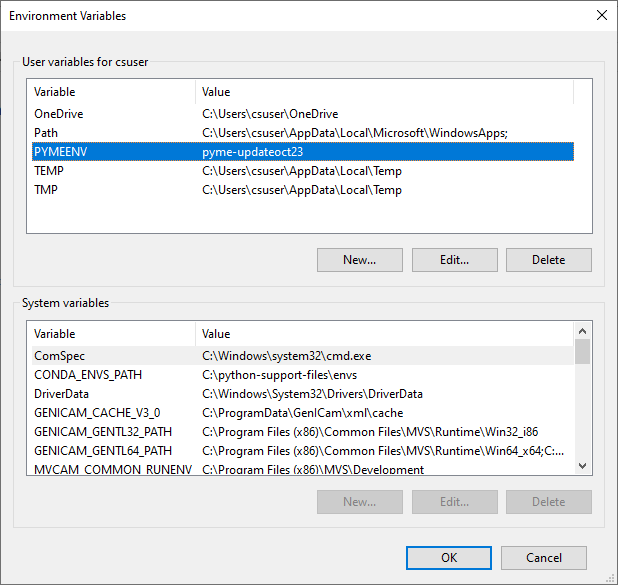
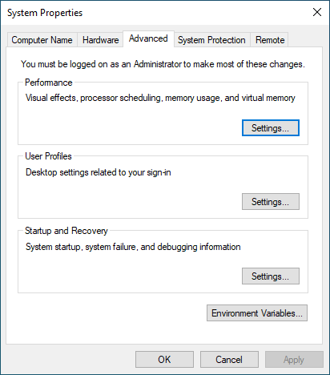
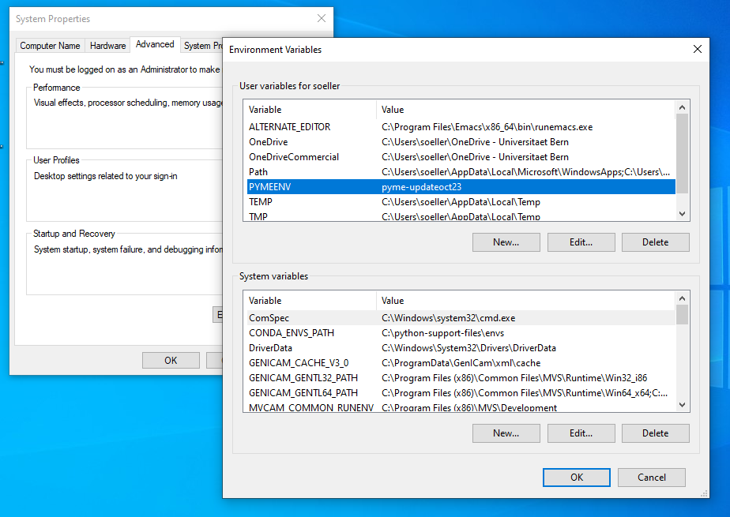

# Overview and Upgrading PYME for Acquisition

## A brief overview of the setup steps on an acquisition PC

1. Create a conda environment with all the relevant PYME and related packages. Take care to make it accessible for all users (with the understanding of only one user accessing it at a time) by setting env path and permission accordingly. Details in the [conda setup notes](conda-setup.md).
2. Complete the site specific config, installing relevant config files, camera settings etc and set up launchers to launch the relevant apps. Details in the [site config install info](PYME-cs-siteconfig.md).
3. Set up the relevant hardware drivers, DLLs and associated configuration. Some camera related info is in the [Andor camera setup notes](andor-camera-setup.md) and the [IDS camera setup notes](IDS-camera-setup.md). Other drivers depend on the hardware used on the system.

## Specific notes when upgrading

Upgrades are best performed by creating a new *upgrade environment*, i.e. by making a new conda environment and installing the newer version of PYME etc into it.

There are a few things one needs to check when implementing this approach:

1. The permissions of newly created environments need to be carefully adjusted to allow other users to execute apps in the new environment. See also the details explained in our [conda setup notes](conda-setup.md).

2. All config files need to be installed into the newly created environment (including `config.yaml`, camera config files, protocols). This can be done by copying across from existing environments or, perhaps better, by running the PYME siteconfig installer as `python install_config_files.py dist`. **Make sure** you do this while the new environment is activated. Details, see also the [site config install info](PYME-cs-siteconfig.md).

3. We are using an environment variable driven way to switch to using a new conda env, so that the same launchers can seamlessly switch over without any further file editing. The gist is that users can set an environment variable `PYMEENV` that contains the name of the new environment to use. On windows, there are various ways to set this environment variable, some are illustrated below. If this variable is not set (the default) then the conda environment named `pyme-shared` is used.

### Ways to set the PYMEENV environment variable

There are a couple of fairly straightforward ways to set environment variables with the GUI on windows. These can be used to set the `PYMEENV` variable as desired.

#### Non-admin users

Go to Control Panel, select User Accounts, then select User Accounts again and you should see a window that has an entry `Change my environment variables` at the bottom left.

When you click on that link you get a window that allows you to create new and edit existing user environment variables (editing of system variables will be grayed out). The variable to create (or edit) is called `PYMEENV` - its value must point to an existing conda environment that has all the PYME apps installed. In the example below the value is `pyme-updateoct23`.

#### Admin users

Admin users can straight search for the "edit system environment variables" or similar expression in the search box. The main hit that comes up should open the dialogue below.

Follow the link `Environment Variables...` which brings up the dialog as above but now you can choose to edit both user environment variables and system environment variables. Depending on what you are trying to achieve you may opt for system variables (e.g. change the default for all users) or user variables (e.g. testing setting for you as a single user). Note that settings by individual users of the user environment variable can override the system default (I believe). Set the `PYMEENV` variable as explained above.

Some further hints on setting environment variables can be found in various places, for example [this page](https://www.howtogeek.com/787217/how-to-edit-environment-variables-on-windows-10-or-11/).