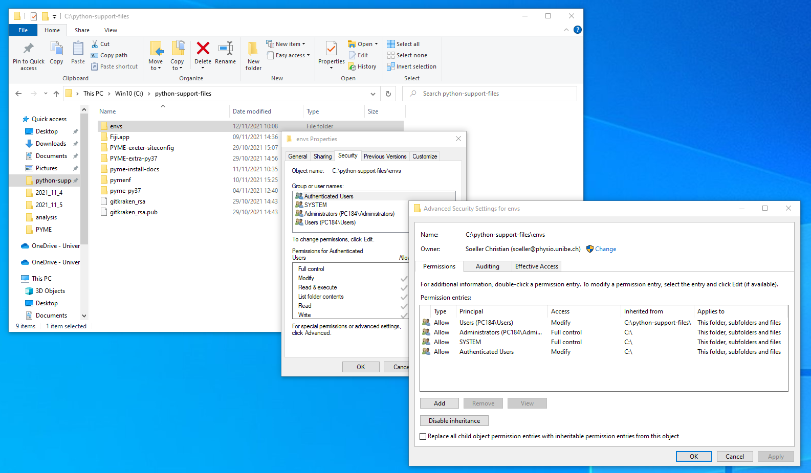
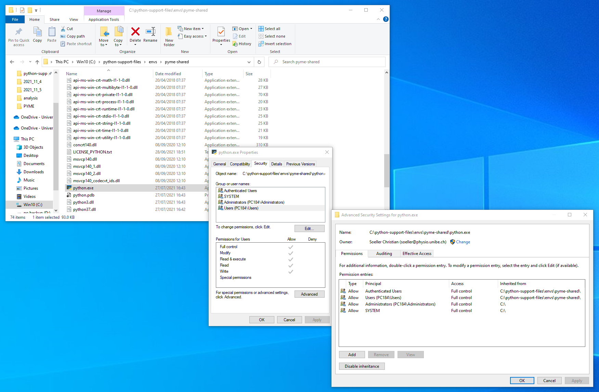

# Installing an environment for all users

We prefer to use conda enviroments for acquisition and general PYME app use. This allows adding experimental configs without harming the current working setup etc.

Installing environments accessible for all users with miniconda (or Anaconda in general) needs a little extra work. Windows file permissions will likely get into it as well...

**TODO**: notes below need fleshing out...

## Create the environment

- install by prefix in a generally accessible directory - in these examples we call our environment `pyme-shared`

## Make more easily usable for all users

- add the parent directory of those environments to the following environment variable: `CONDA_ENVS_PATH`

Example:

	set CONDA_ENVS_PATH=C:\python-support-files\envs

With that setting (probably best set as system environment variable so that every user has this automatically available) individual users can see this environment in their list of environments:

	conda env list

and also activate this environment using the usual

	conda activate pyme-shared

## Directory permissions

We needed to set permissions for the files in the environment. Eventually, I tried to set `Full Control` for the `envs` directory and also tick the box `Replace all child object permissions...`. This was eventually done for both the `Users` and `Authenticated Users` groups.

This seems to have done the job but a number of questions remain:

- is setting this for both groups necessary?
- do we need this done via the `Advanced Settings` tab and tick the `Replace all child...` box?

We need to check on a new computer if all of these settings are necessary or if a subset is sufficient.

### Tests

To test permissions, login as a standard user, activate the environment in question (for us typically `pyme-shared`) and try to execute `python.exe` from an Anaconda shell, e.g.

	python -V

If this prints the Python version all is fine. If you get `permission denied` further permission fiddling is required.

Below we show the settings of the `envs` folder and the permissions on `python.exe`

## Launchers

Launchers are created to simplify app opening and are supposed to take care of environment variables, conda virtualenv (virtual environment) activation and any other setup aspects that are best hidden from the average user. See also the [launcher doc](https://github.com/csoeller/pyme-install-docs/blob/master/PYME%20windows%20launchers.md).

### Put launchers on everybody's desktop

The launchers are typically in a site specific directory. Create shortcuts for all relevant launchers in that directory (typically as admin) and then move these shortcuts into the public desktop. The following instructions detail how to go about that (source [superuser.com](https://superuser.com/questions/984866/how-to-make-a-desktop-shortcut-available-for-all-users-in-windows-10)):

Put it in this folder (exactly like below, with the % characters):

	%public%\Desktop

e.g. using this command:

	copy file.lnk %public%\Desktop

This should be more reliable in case Users location is changed.

Bonus: other ways to open the public desktop in Explorer:

- you can paste `%public%\Desktop` in the Explorer location bar
- or hit `Win+R` and enter `%public%\Desktop`

**TODO**: add further launcher info

## Tests

**TODO**: add some tests to verify correct install