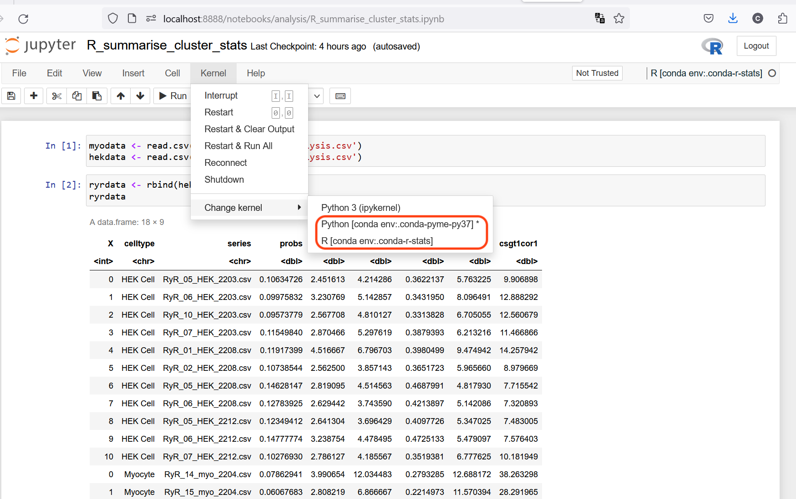

# Running Python and R notebooks from the same Jupyter notebook server

We increasingly use both R and Python notebooks in the same research project. One annoying issue is that we generally found we had to launch separate calls of

	jupyter notebook

from either the Python conda environment to run Python notebooks or from the R conda environment to run R notebooks. This is annoying to put it mildly.

**Aim**: just fire up a jupyter notebook server once, say from the Python conda environment set up for PYME, and be able to launch both Python and R notebooks from the filebrowser that comes up.

## The scenario

We have two separate conda environments set up, one for the PYME apps etc, the other for the R environment, which look like this when we list them:

	conda env list
	
	# conda environments:
	#
	base                     C:\ProgramData\miniconda3
	pyme-py37             *  C:\Users\XXXXX\.conda\envs\pyme-py37
	r-stats                  C:\Users\XXXXX\.conda\envs\r-stats

I.e. `pyme-py37` for PYME and `r-stats` for R based code. You may have named your environments differently, the idea is still the same and we trust you will replace with the name of your environments where applicable below. Note we also have a `base` environment, this we can generally disregard.

## The approach

We follow the idea described in [this blog page](https://towardsdatascience.com/get-your-conda-environment-to-show-in-jupyter-notebooks-the-easy-way-17010b76e874). Basically, we install a Jupyter notebook extension called `nb_conda_kernels` which registers the jupyter kernels from the various environments to become selectable in the Jupyter notebook interface within your web client (firefox, Chrome, etc, depending which one you use to show your Jupyter notebooks). A little additional work was needed to remove some other kernel entries that created a little bit of trouble as I descibe below.

## The details

Ok, let's spell out the details and show how it should work.

1. install `nb_conda_kernels` in the PYME conda environment `pyme-py37`:

	`conda install nb_conda_kernels`
	
	
2. now I had the issue that some "rogue" kernels seemed to be around in the two conda environments that I had made.

E.g. in the PYME environment, listing the kernels Jupyter knows about (obtained with the command `jupyter kernelspec list`) gave the following:

	jupyter kernelspec list
	
		Available kernels:
  			ir         C:\Users\XXXX\AppData\Roaming\jupyter\kernels\ir
  			python3    C:\Users\XXXX\.conda\envs\pyme-py37\share\jupyter\kernels\python3
  
In other words, there appeared to be a R kernel (`ir`) in this environment. Indeed, when I started the Jupyter notebook server with `jupyter notebook` and opened an R notebook, I got an issue with lots of missing DLLs, presumably because the `ir` kernel is somehow not a fully working kernel (not sure where it came from in the first place). So the thing to do is to remove the `ir` kernel in the PYME conda environment.

This was achieved with

	jupyter kernelspec remove ir
	
		Kernel specs to remove:
  			ir                    C:\Users\XXXX\AppData\Roaming\jupyter\kernels\ir
			Remove 1 kernel specs [y/N]: y
			[RemoveKernelSpec] Removed C:\Users\XXXX\AppData\Roaming\jupyter\kernels\ir
 
Indeed, this left the `pyme-py37` conda environment just with the python3 kernel:
 
	jupyter kernelspec list
	
		Available kernels:
  			python3    C:\Users\XXXX\.conda\envs\pyme-py37\share\jupyter\kernels\python3

Similarly, I removed a python3 kernel from the `r-stats` environment, but be sure to leave the `ir` kernel in that conda environment.

## All done - launch jupyter

Now I launched the jupyter notebook server from the `pyme-py37` conda environment:

	jupyter notebook

It brings up the usual jupyter file browser in my web browser. If I open a Python based notebook it connects it with the Python3 kernel from `pyme-py37` correctly. Similalrly, if I open an R based notebook, it connects it with the R kernel from `r-stats` correctly.

You can see the two kernels known to Jupyter in the Kernel menu, as shown in the screenshot below. This can also be used to manually assign the desired kernel to your notebook session, if you think you need to. As long as you only have these two kernels as described for Python and R, respectively, they should be automatically chosen for Python/R notebooks as appropriate. If you had more kernels from more environments, you may have to resort to manual selection. Anyway, here is the screenshot:

Note that there is also a `Python 3 (ipykernel)` in the list. I am not certain if this is again the Python kernel from `pyme-py37` or a different one. In any case, it does not seem to get in the way.
