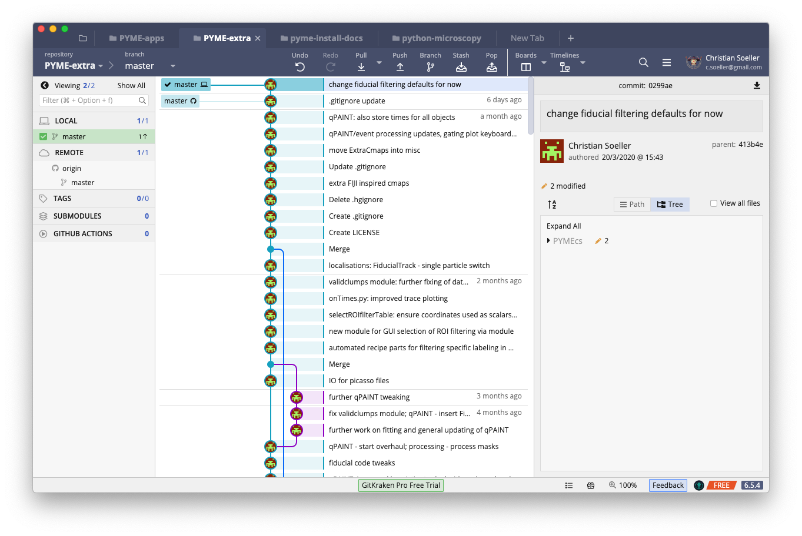
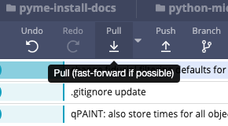

# Updating repositories

We regularly need to update our repositories to take advantage of new bug fixes, features etc. We will primarily do this with gitkraken as our git client.

## Example: Update PYME-extra

### Signs you may need to upgrade

Gitkraken is actually quite nice in how it shows you may want to update. The way you can check is by just opening your current repository of interest in gitkraken. You will notice that there is generally a ```master``` pointer into the list of commits of the repository.

In the gitkraken repository snapshot shown below you notice that there are 2 ```master``` pointers, one has the "local computer" icon on the right, the other has the "github" icon (some version of a cat in silhouette). If the two ```master``` pointers point to different commits, that implies that the local computer respository copy and the remote github copy are at different levels of updates. In the image below, the local computer master is ahead of the github master pointer. This is because I made some changes and commits to the local copy that I have not yet "pushed" to the guthub repository. In repository parlance, my local repository is ahead of the remote github repository.

Note that in almost all cases that you will encounter, the situation is the other way around, i.e. the local computer master pointer will be below the github pointer.




### How to update your repository

To bring your local repository to the same level as the remote github repository, which is what you generally want to do, you need to **pull** the changes into your local computer repository, as shown below. Just press the button and wait for the operation to complete.





### After updating

Generally, there should not be anything else to do, because we installed the python code using the **develop** option, i.e.

        python setup.py develop
        
This will ensure that any new python code is picked up automatically. In the rare situation that some C code needs to be compiled I will let you know. Typically that just means going to the main directory of the repository on your computer and building just as you did when installing. **But this is normally not necessary**.

